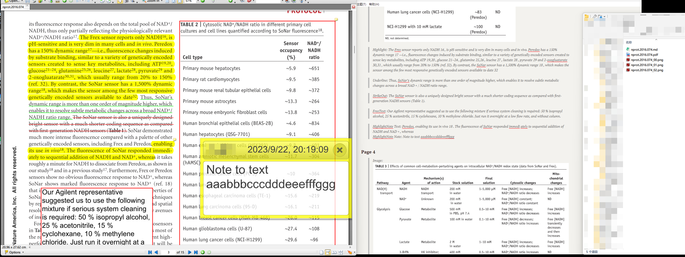

# PDFScraping

This tool dumps annotations (highlights, textboxes, popups, strikeouts, underlines) from journal PDFs, and create images from rectangle annotations.

This project is inspired by [pdfannots](https://github.com/0xabu/pdfannots) project.

# Supported

This project is still in proof-of-concept stage. Awful coding style and bugs are normal and expected.

Currently, I used two PDF libraries because [PdfPig](https://github.com/UglyToad/PdfPig) does not support PDF rendering and processing metadata with [PDFiumCore](https://github.com/Dtronix/PDFiumCore) is very painful.

As the project now uses System.Drawing, it does not support non-windows platforms.

- [x] Highlight
- [x] Highlight note
- [x] FreeText
- [x] Popup
- [x] Strikeout
- [x] Underline
- [x] Rectangle
- [x] Metadata from pdf (title, doi)
- [x] Metadata from XMP (title, doi)
- [ ] Bookmarks
- [ ] Citations

# Example

